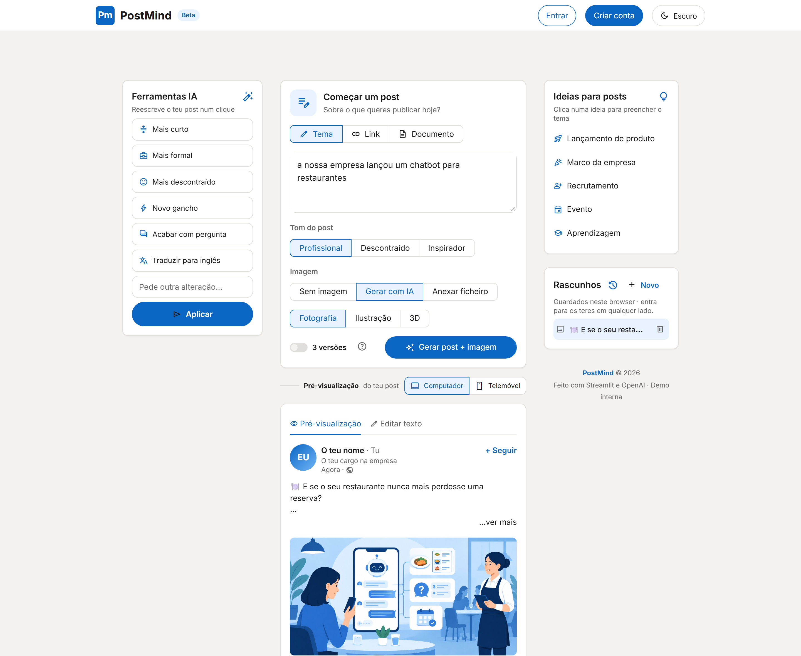
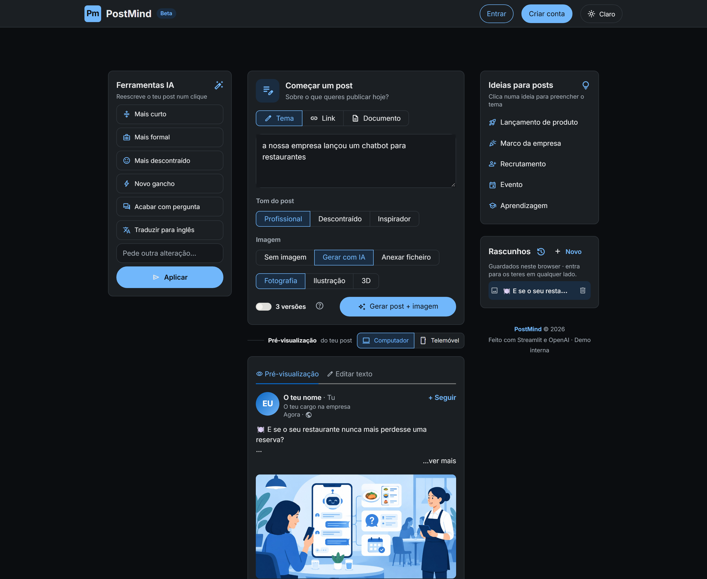
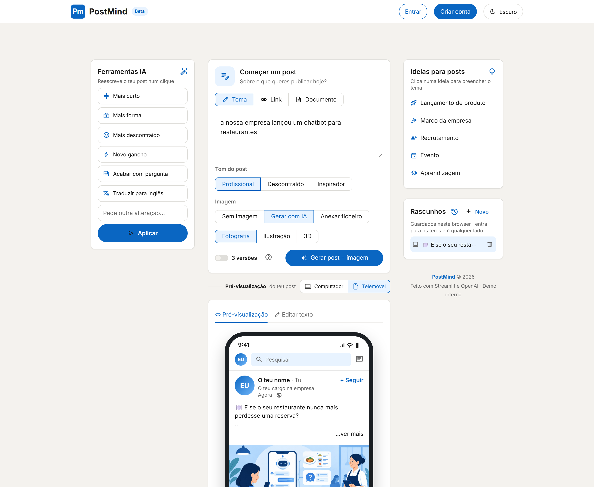
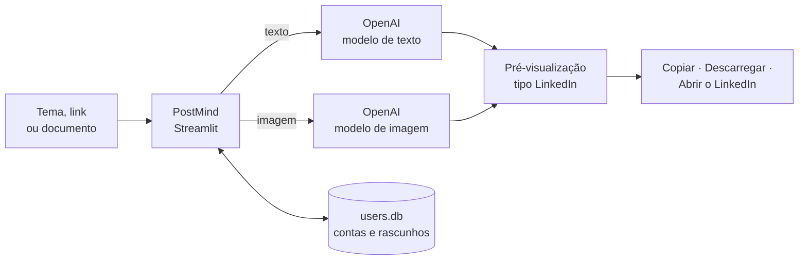

<div align="center">

# ✍️ PostMind

**Posts para o LinkedIn escritos com IA — com imagem, pré-visualização real e prontos a publicar.**

Escreve o tema, escolhe o tom e carrega em **Gerar**. Em segundos tens o texto, as hashtags e uma imagem feita à medida.


**[🌐 Ver a página de apresentação](https://giovannacostaxavier.github.io/postmind/)**

> ℹ️ **Demo interna.** Este repositório serve para mostrar o projeto e o código. A app não está disponível para instalação nem uso público.



</div>

---

## Índice

- [Funcionalidades](#-funcionalidades)
- [Capturas de ecrã](#-capturas-de-ecrã)
- [Como funciona](#-como-funciona)
- [Segurança e privacidade](#-segurança-e-privacidade)
- [Estrutura do projeto](#-estrutura-do-projeto)
- [Próximos passos](#-próximos-passos)

---

## ✨ Funcionalidades

### 📝 Escrever o post

| | |
|---|---|
| **Três fontes** | Escreve a partir de um **tema** («lançámos um chatbot para restaurantes»), de um **link** de notícia ou artigo, ou de um **documento** (PDF, TXT, MD). |
| **Três tons** | **Profissional**, **Descontraído** ou **Inspirador**. |
| **3 versões de uma vez** | A IA escreve três abordagens em paralelo — **História**, **Direto** e **Em lista** — e escolhes a melhor. |
| **Escrita em direto** | O texto aparece palavra a palavra na pré-visualização, enquanto a IA escreve. |
| **Pronto para o LinkedIn** | Gancho forte na 1.ª linha, parágrafos curtos, emojis com moderação, chamada à ação e 3 a 5 hashtags. Sempre em português de Portugal. |
| **Boas práticas com links** | Quando a fonte é um link, o post não o inclui (o LinkedIn reduz o alcance) e sugere «Link nos comentários 👇». |
| **Ideias rápidas** | Cinco sugestões (lançamento, marco, recrutamento, evento, aprendizagem) preenchem o tema num clique. |

### 🪄 Ferramentas IA

Depois de gerar, melhora o post num clique — e **desfaz** se não gostares:

- **Mais curto** · **Mais formal** · **Mais descontraído**
- **Novo gancho** — reescreve só a primeira linha
- **Acabar com pergunta** — para puxar comentários
- **Traduzir para inglês**
- **Pedido livre** — escreve qualquer alteração («menciona a equipa do Porto»)

### 🖼️ Imagem

- **Gerar com IA** em três estilos: **Fotografia**, **Ilustração** ou **3D**, já no formato horizontal do LinkedIn.
- **Anexar ficheiro** próprio: imagem (PNG, JPG, GIF, WEBP) ou vídeo (MP4, MOV).
- **Editar a imagem com IA**: «Mais azul», «Minimalista», «Mais luminosa», «Ilustração» ou um pedido livre («põe o fundo em Lisboa»), com **Desfazer edição**.
- **Nova imagem** e **Descarregar** num clique.

### 👀 Pré-visualização igual ao LinkedIn

- O post aparece **como no feed**: nome, foto, reações, hashtags a azul.
- Vista de **Computador** e de **Telemóvel** (com moldura de telemóvel e barra da app).
- Mostra **onde cai o «…ver mais»** e avisa se o gancho for cortado.
- **Contador de caracteres** com o limite do LinkedIn (3000).
- **Texto editável** diretamente na página.

### 🚀 Publicar

- **Copiar texto** para a área de transferência.
- **Publicar no LinkedIn** — abre o LinkedIn com o texto já preenchido (a imagem anexa-se à mão).

### 👤 Contas e rascunhos

- **Sem conta**: os rascunhos ficam guardados neste browser.
- **Com conta**: entra com **Google**, **LinkedIn** ou **email + palavra-passe** e os rascunhos passam para a tua conta.
- **Rascunhos automáticos**: cada post gerado ou editado é guardado sozinho, com e sem imagem.
- **Sessão de 30 dias**: não precisas de voltar a entrar sempre.

### 🎨 Aspeto

- Design inspirado no LinkedIn (cores, cartões, tipografia Inter).
- **Modo escuro** que fica memorizado.
- Interface toda em **português de Portugal**.

---

## 📸 Capturas de ecrã

| Modo claro | Modo escuro |
|---|---|
|  |  |

<p align="center">
  <b>Pré-visualização no telemóvel</b><br>
  
</p>

---

## 🔧 Como funciona



- **Streamlit** desenha a página só com Python.
- O **SDK oficial `openai`** gera o texto (em streaming) e a imagem.
- **SQLite** (`users.db`) guarda contas e rascunhos localmente.
- **`st.login`** (OpenID Connect) trata do login com Google e LinkedIn.

---

## 🔒 Segurança e privacidade

- **Nenhuma chave está neste repositório.** As chaves de acesso (OpenAI, Google e LinkedIn) existem apenas no computador onde a demo corre e nunca são enviadas para o GitHub.
- **Palavras-passe cifradas** com **scrypt** e *salt* aleatório — nunca em texto simples.
- **Sessões** guardadas só como *hash* SHA-256 do token, válidas 30 dias, apagadas ao sair.
- **Rascunhos isolados**: cada utilizador (ou browser) só vê os seus.
- **Dados locais**: contas e rascunhos ficam numa base de dados local, fora do repositório.

---

## 📁 Estrutura do projeto

```text
postmind/
├── app.py                        # Página Streamlit e chamadas à OpenAI
├── accounts.py                   # Contas email + palavra-passe e sessões (SQLite, scrypt)
├── drafts.py                     # Rascunhos guardados automaticamente
├── sources.py                    # Ler links e documentos (PDF/TXT/MD)
├── styles.css                    # Design inspirado no LinkedIn
├── dark.css                      # Modo escuro
├── requirements.txt              # Dependências Python
├── .streamlit/
│   └── config.toml               # Tema e opções do Streamlit
└── docs/                         # Página de apresentação (GitHub Pages) e capturas
```

---

## 🧭 Próximos passos

- [ ] Publicar diretamente no LinkedIn pela API oficial (com imagem incluída).
- [ ] Agendar posts.
- [ ] Histórico de desempenho dos posts.

---

<div align="center">

Feito com **Streamlit** e **OpenAI** · Demo interna · 2026

</div>
